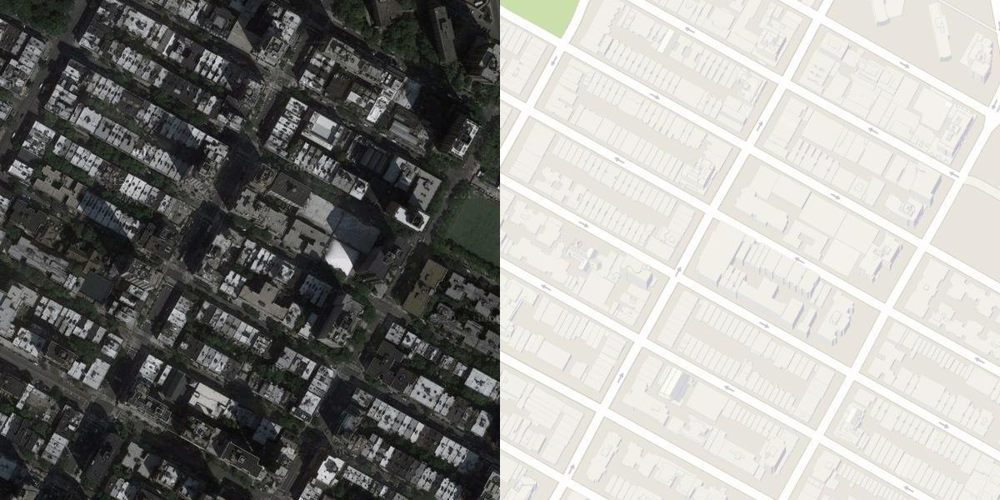
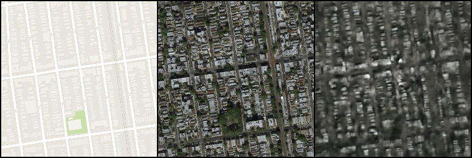
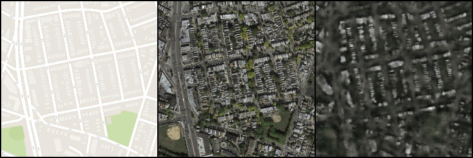
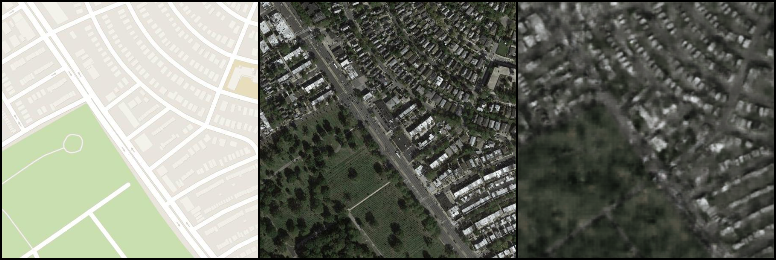
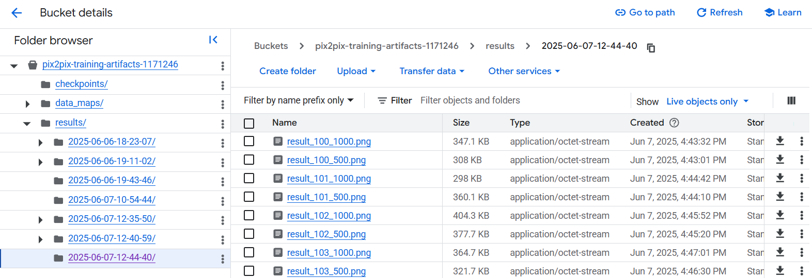

### VertexAI Pix2Pix (GAN) Training Job
---

Pix2Pix training made easy to execute and customize. You just need to:

- Store your training data on **Google Cloud Storage**
- Create a **Service Account** with:
    
    - Storage Admin
    - Vertex AI User

- Ensure the **service quotas** for specified GPU accelerator is eligable for your Google Project
- Submit the job

### Local execution
---

There is a way to execute the job locally as a Docker container, you just need to prepare your Service Account JSON file encoded as base64 and execute the container with argument **--service_account_json_b64=YOUR_BASE64**

### General Steps

--- 

1. Build your Docker image:
    ```sh
    docker build -t <image-name> .
    ```

2. If want to execute the training job on the GCP, push the image to some kind of image repository:
    ```sh
    docker tag <image-name>:latest <repo-name>:<tag>
    docker push <repo-name>:<tag>
    ```

3. Prepare your training and validation dataset with a prefix specified with **--bucket_data_prefix** consisting of **train/** and **val/** subdirectories that contain the images merged horizontally, i.e.:



You can specify which side is a target with **--target_side**
<br>

4. For cloud execution, follow the steps from the **train_submit.ipynb** in order to submit the job on Vertex AI.
<br>
5. In case of local execution, run the docker container with neccessary arguments:
    ```sh
    docker --gpus all run -d <image-name>
        --bucket_name=<bucket-name>
        --service_account_json_b64=<sa_json_b64>
    ```

### Specifying the parameters
---

You can play with different parameters when submiting your job:

```sh
usage: train.py [-h] 
    --bucket_name BUCKET_NAME
    [--service_account_json_b64 SERVICE_ACCOUNT_JSON_B64] # for local
    [--target_side TARGET_SIDE] # left/right, default: left
    [--execution_type EXECUTION_TYPE] # cloud/local, default: local
    [--bucket_data_prefix BUCKET_DATA_PREFIX] # default: data 
    [--epoch EPOCH] # starting epoch, default: 0
    [--num_epochs NUM_EPOCHS] # default: 200
    [--batch_size BATCH_SIZE] # default: 1
    [--lr LR] # default: 0.0002
    [--b1 B1] # default: 0.5
    [--b2 B2] # default: 0.999
    [--L1lambda L1LAMBDA] # default: 100
    [--train_path TRAIN_PATH] # the data is read from here locally, default: data/train
    [--val_path VAL_PATH] # default data/val
    [--checkpoint_interval CHECKPOINT_INTERVAL] # default: 30
    [--checkpoint_path CHECKPOINT_PATH] # default: checkpoints
    [--log_path LOG_PATH] # default: run/pix2pix
    [--results_path RESULTS_PATH] # bucket path for validation results, default: results/{dt.datetime.now().strftime('%Y-%m-%d-%H-%M-%S')}
    [--load_model_path LOAD_MODEL_PATH] # default: ""
    [--transform_type TRANSFORM_TYPE] # default: augment
```

### Sample Training Results - Google Maps Dataset
---

Here are some sample results obtained from the training on a popular dataset with aerial photos from Google Maps:








### Results
---

Trained model is saved as checkpoint on the same bucket that contains the dataset, also every 500 iterations, the validation output is produced and saved on the bucket as well:


